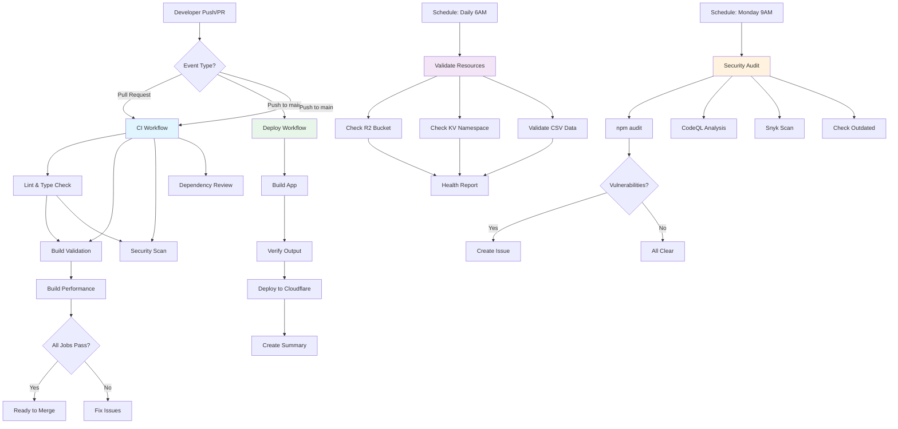
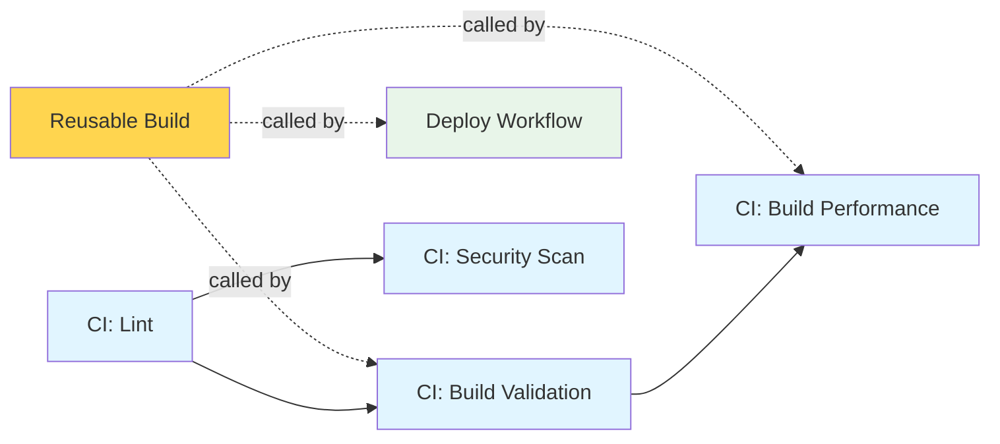
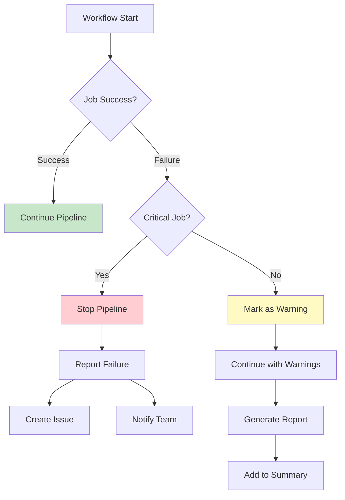

# GitHub Actions Workflows Architecture

## Workflow Execution Flow



## Workflow Dependencies



## Timeline View

```mermaid
gantt
    title Workflow Execution Timeline
    dateFormat HH:mm
    section PR Created
    Lint & Type Check     :a1, 00:00, 2m
    Build Validation      :a2, after a1, 3m
    Security Scan         :a3, after a1, 5m
    Dependency Review     :a4, 00:00, 1m
    Build Performance     :a5, after a2, 3m
    
    section Push to Main
    Build & Deploy        :b1, 00:00, 5m
    
    section Scheduled
    Security Audit (Weekly)     :c1, 00:00, 10m
    Resource Validation (Daily) :d1, 00:00, 3m
```



## Resource Flow

```
┌─────────────────────────────────────────────────────────┐
│                    GitHub Repository                     │
└────────────┬────────────────────────────────────────────┘
             │
             ├─── Push/PR ───> CI Workflow
             │                      │
             │                      ├─── Lint/TypeCheck
             │                      ├─── Build (uses Reusable)
             │                      ├─── Security Scan
             │                      └─── Performance Analysis
             │
             ├─── Push main ─> Deploy Workflow
             │                      │
             │                      ├─── Build (uses Reusable)
             │                      ├─── Verify Output
             │                      └─── Deploy to Cloudflare
             │                              │
             │                              └─> Cloudflare Pages
             │                                      ├─── R2 Bucket
             │                                      ├─── KV Store
             │                                      └─── Edge Workers
             │
             ├─── Schedule ───> Security Audit
             │                      ├─── npm audit
             │                      ├─── CodeQL
             │                      ├─── Snyk (optional)
             │                      └─── Create Issue (if needed)
             │
             └─── Schedule ───> Resource Validation
                                    ├─── Check R2
                                    ├─── Check KV
                                    ├─── Validate CSV
                                    └─── Health Report
```

## Security Layers

```
┌───────────────────────────────────────────────────────────┐
│                    Security Pipeline                       │
├───────────────────────────────────────────────────────────┤
│  Layer 1: Static Analysis                                 │
│  • ESLint (code quality)                                  │
│  • TypeScript (type safety)                               │
├───────────────────────────────────────────────────────────┤
│  Layer 2: Dependency Scanning                             │
│  • npm audit (known vulnerabilities)                      │
│  • Dependency Review (new vulnerabilities in PRs)         │
│  • Snyk (advanced scanning - optional)                    │
├───────────────────────────────────────────────────────────┤
│  Layer 3: Code Analysis                                   │
│  • CodeQL (security-extended queries)                     │
│  • Pattern detection (SQL injection, XSS, etc.)           │
├───────────────────────────────────────────────────────────┤
│  Layer 4: Runtime Validation                              │
│  • Build verification                                     │
│  • Output validation                                      │
│  • Resource integrity checks                              │
└───────────────────────────────────────────────────────────┘
```

## Optimization Strategy

### Caching Strategy

```
┌─────────────────────────────────────────────────────────┐
│                    Cache Hierarchy                       │
├─────────────────────────────────────────────────────────┤
│  Level 1: npm cache (via actions/setup-node)            │
│  • Cache Key: package-lock.json hash                     │
│  • Location: GitHub Actions cache                        │
│  • TTL: Until package-lock changes                       │
├─────────────────────────────────────────────────────────┤
│  Level 2: node_modules cache (reusable workflow)        │
│  • Cache Key: Node version + package-lock hash           │
│  • Location: GitHub Actions cache                        │
│  • TTL: Until dependencies change                        │
├─────────────────────────────────────────────────────────┤
│  Level 3: Build artifacts (optional)                     │
│  • Storage: GitHub Artifacts                             │
│  • TTL: 7 days                                           │
│  • Size: ~50MB per build                                 │
└─────────────────────────────────────────────────────────┘
```

### Parallel Execution

```
CI Workflow Parallelization:
┌─────────────┬─────────────┬─────────────┬─────────────┐
│ Lint        │ Security    │ Dependency  │ Build       │
│ & TypeCheck │ Scan        │ Review      │ Validation  │
│             │             │             │             │
│ (2 min)     │ (5 min)     │ (1 min)     │ (3 min)     │
└─────────────┴─────────────┴─────────────┴──────┬──────┘
                                                  │
                                          ┌───────▼──────┐
                                          │ Performance  │
                                          │ Report       │
                                          │ (3 min)      │
                                          └──────────────┘

Sequential execution: 14 minutes
Parallel execution: 8 minutes (43% faster)
```

## Error Handling Flow



## Cost Optimization

### GitHub Actions Minutes Usage

```
Monthly Estimate (Public Repository - Free):

CI Workflow:
• Trigger: ~50 PRs + 50 pushes/month
• Duration: ~8 minutes/run
• Total: 100 runs × 8 min = 800 minutes

Deploy Workflow:
• Trigger: ~30 deployments/month
• Duration: ~5 minutes/run
• Total: 30 runs × 5 min = 150 minutes

Security Audit:
• Trigger: 4 times/month (weekly)
• Duration: ~10 minutes/run
• Total: 4 runs × 10 min = 40 minutes

Resource Validation:
• Trigger: 30 times/month (daily)
• Duration: ~3 minutes/run
• Total: 30 runs × 3 min = 90 minutes

Total: ~1,080 minutes/month
GitHub Free Tier: 2,000 minutes/month
Usage: 54% of free tier
```

### Cloudflare Resources

```
Cloudflare Pages (Free Tier):
• Builds: Unlimited
• Bandwidth: 100GB/month
• Requests: 100,000/day
• Build time: Included

R2 Storage (Free Tier):
• Storage: 10GB
• Class A operations: 1M/month
• Class B operations: 10M/month

KV Storage (Free Tier):
• Storage: 1GB
• Reads: 100,000/day
• Writes: 1,000/day
```

## Monitoring & Observability

```
┌───────────────────────────────────────────────────────┐
│              Metrics & Monitoring                      │
├───────────────────────────────────────────────────────┤
│  Build Metrics:                                        │
│  • Build time (tracked per job)                       │
│  • Build size (tracked per deployment)                │
│  • Success rate (tracked per workflow)                │
├───────────────────────────────────────────────────────┤
│  Security Metrics:                                     │
│  • Vulnerabilities found (by severity)                │
│  • Resolution time (via issues)                       │
│  • False positive rate                                │
├───────────────────────────────────────────────────────┤
│  Resource Health:                                      │
│  • R2 bucket status (daily check)                     │
│  • KV namespace status (daily check)                  │
│  • CSV data integrity (daily check)                   │
├───────────────────────────────────────────────────────┤
│  Deployment Metrics:                                   │
│  • Deploy frequency                                    │
│  • Deploy success rate                                │
│  • Rollback rate                                      │
└───────────────────────────────────────────────────────┘
```
